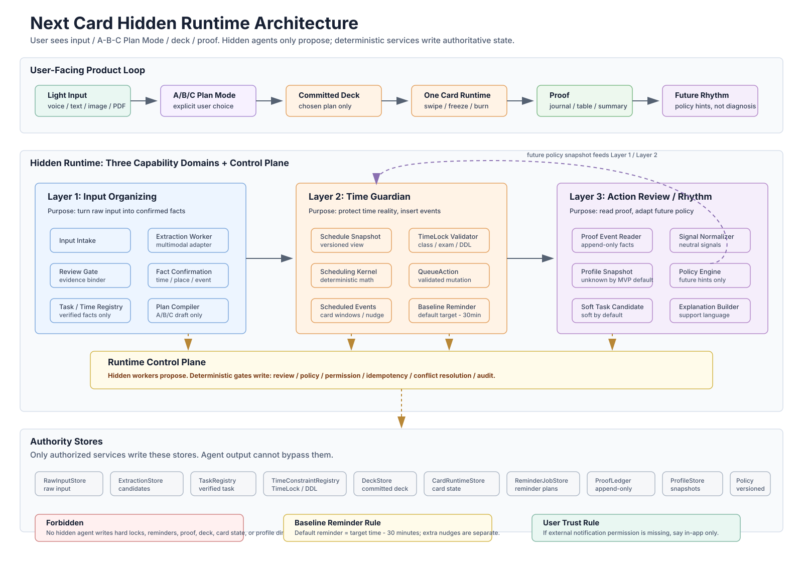

# Next Card Overall Hidden Runtime Architecture

Date: 2026-05-21
Status: overall architecture summary

## One-Sentence Architecture

Next Card is a card-first execution product with hidden agent capabilities behind a governed runtime:

```text
light input
-> confirmed facts
-> explicit A/B/C Plan Mode
-> committed deck
-> automatic schedule event insertion
-> one-card execution
-> append-only proof
-> lightweight rhythm adaptation for future plans
```

## User-Facing Product

Users only see:

- input,
- A/B/C Plan Mode,
- deck/card execution,
- proof,
- reminder status,
- summary and journal.

Users must not see:

- agent 1 / agent 2 / agent 3 labels,
- internal agent chat,
- hidden worker routing,
- profile diagnosis,
- moral scoring.

## Hidden Runtime Principle

The hidden runtime uses this rule:

```text
LLM / agent / model worker -> candidate / draft / proposal / explanation
deterministic service / gate -> authoritative write
```

The control plane owns:

- state authority,
- review gates,
- policy gates,
- permission gates,
- idempotency,
- conflict resolution,
- audit logs,
- versioned profile/policy,
- rollback-safe writes.

## Three Hidden Capability Domains

### Layer 1: Input Organizing

Purpose:

```text
turn user input into confirmed task/time/location facts
```

Main pieces:

- Input Intake,
- Extraction Worker / Multimodal Adapter,
- Review Gate + Evidence Binder,
- Pre-Deck Fact Confirmation,
- Task Registry / Time Constraint Registry,
- Plan Compiler handoff.

Key boundary:

Layer 1 may prepare candidates and Plan Mode handoff, but it must not commit deck, reminders, proof, profile, or hard locks directly.

### Layer 2: Time Guardian

Purpose:

```text
protect time reality and insert internal schedule events
```

Main pieces:

- Schedule Snapshot,
- TimeLock Validator,
- Scheduling Kernel,
- QueueAction Validator,
- ScheduledEvent Inserter,
- Baseline Reminder,
- Nudge / Deadline Warning,
- Freeze Return.

Key boundary:

Layer 2 may automatically insert internal events around verified facts, but it must not invent or move hard locks, schedule unchosen plans, delete baseline reminders, fake external notification delivery, or directly append proof.

### Layer 3: Action Review And Profile

Purpose:

```text
read proof evidence and produce future rhythm policy
```

Main pieces:

- Proof Event Reader,
- Signal Normalizer,
- Profile Aggregator,
- Policy Engine,
- System Soft Task Candidate Generator,
- Explanation Builder.

Key boundary:

Layer 3 is lightweight in MVP. It emits future-facing `ProfileSnapshot` and `AgentPolicySnapshot` hints only. It must not directly mutate deck, card, reminder, proof, deadline, or hard-lock state.

## Core Loop

```text
User input
-> Layer 1 confirms facts
-> A/B/C Plan Mode
-> Deck Commit
-> Layer 2 inserts schedule events and reminders
-> Card Runtime executes one card at a time
-> Proof Ledger records facts
-> Layer 3 creates future policy hints
-> future Layer 1/2 reads policy snapshot
```

## SVG Flowchart


